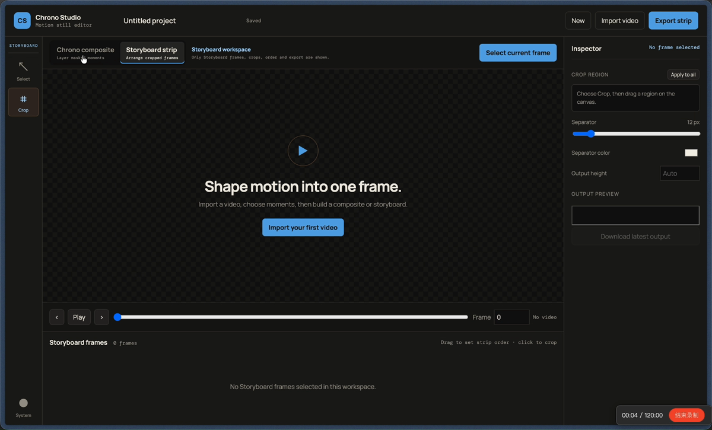
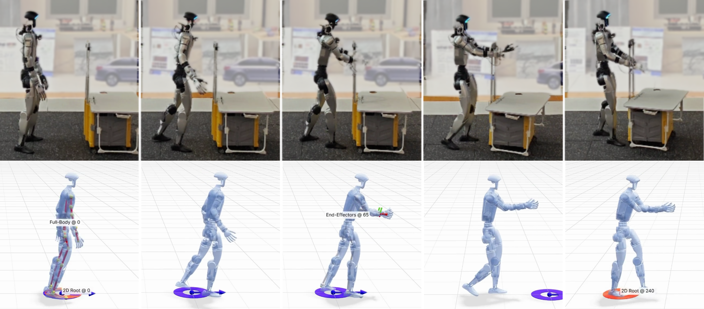

# Chrono Studio

Chrono Studio is a local WebUI for turning videos into motion-focused still
images. It combines two workflows in one editor:

- **Chrono composite**: pick moments from a video, segment the subject with SAM2,
  reorder the layers, tune effects, and export a single chronophotography image.
- **Storyboard strip**: select frames, crop each shot, reorder them, and export a
  clean horizontal storyboard strip.

The app is designed for fast visual iteration: frame-accurate navigation,
click-to-select frame cards, drag-to-reorder timelines, double-click image
previews, automatic project persistence, and PNG export.

## Demo

### Operation

[](assets/demo-operation.mp4)

[Watch the operation demo](assets/demo-operation.mp4)

<table>
  <tr>
    <td width="50%" valign="top">
      <h3>Chrono Composite</h3>
      
    </td>
    <td width="50%" valign="top">
      <h3>Storyboard Strip</h3>
      
    </td>
  </tr>
</table>

## How to Use

<table>
  <tr>
    <td width="50%" valign="top">
      <h3>Mode Chrono Composite</h3>
      <ul>
        <li>Step 0: import the video.</li>
        <li>Step 1: select the frame to process.</li>
        <li>Step 2: choose the tool to select the object.</li>
        <li>Step 3: add the hint point/box to the image.</li>
        <li>Step 4: click to generate the segmentation.</li>
        <li>Step 5: choose the next frames and process.</li>
        <li>Step 6: generate the composite picture.</li>
        <li>You can also change the effects and the layer order.</li>
      </ul>
    </td>
    <td width="50%" valign="top">
      <h3>Mode Storyboard Strip</h3>
      <ul>
        <li>Step 0: import the video.</li>
        <li>Step 1: select the frames to process.</li>
        <li>Step 2: crop the part you need, then it's ok.</li>
        <li>Step 3: choose the next frames and process.</li>
        <li>Step 4: generate the strip picture.</li>
        <li>You can also modify the separator between the crops.</li>
      </ul>
    </td>
  </tr>
</table>

Projects are saved automatically under `workspace/projects`, so reloads keep the
current video, selected frames, masks, crops, and settings.

## How to Install

### Requirements

- Windows with PowerShell.
- Miniconda or Anaconda installed under `%USERPROFILE%\miniconda3`.
- NVIDIA GPU with a CUDA-compatible driver is recommended for SAM2.

### Setup

```powershell
git clone <your-repo-url>
cd chrono-compositor
.\setup_conda.ps1
```

The setup script creates or updates the `chrono-compositor` Conda environment,
installs Python dependencies from `environment.yml` and `requirements.txt`,
downloads the SAM2.1 checkpoint into `models/`, and runs a smoke test.

### Run

```powershell
.\start.ps1
```

Open:

```text
http://127.0.0.1:8766
```

To expose the app to another machine on a trusted network:

```powershell
.\start.ps1 -Localhost no
```

You can override the port with:

```powershell
$env:CHRONO_PORT = 9000
.\start.ps1
```

## Project Files

Runtime data is intentionally excluded from Git:

```text
workspace/
  videos/       Uploaded source videos and metadata
  frames/       Lazily decoded frame cache
  masks/        SAM2 masks and overlays
  outputs/      Rendered images and JSON sidecars
  projects/     Saved editor project documents
```

SAM2 checkpoints in `models/` are also excluded from Git and can be restored by
running `setup_conda.ps1`.

## License

Chrono Studio is released under the Apache License 2.0. It uses SAM2, whose
code and model checkpoints are also licensed under Apache 2.0 by Meta.
